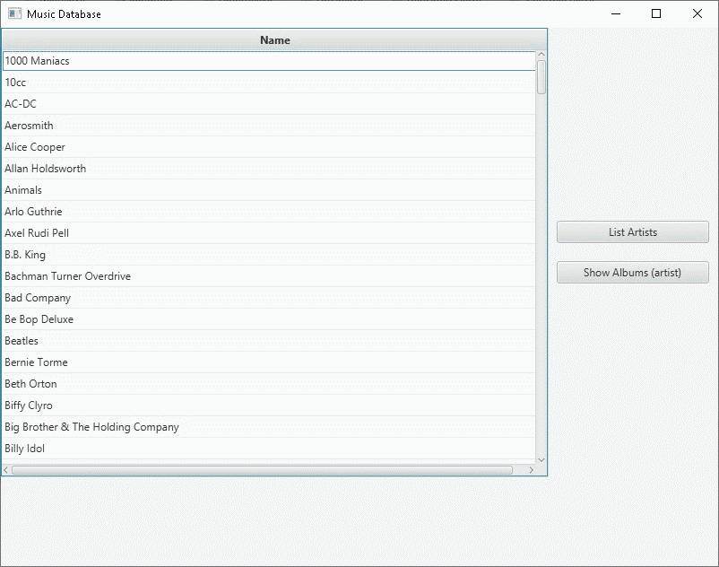

#Overall

MusicDatabase simple database app with graphical UI (JavaFX) and connection to local SQL datatbase file (SQLite driver). 
Using Java 9 module feature to separate UI from Model and Controller layers. Maven multimodule support, creates thin jar for each and every module and one fat jat wit all modules (Please refer to [how to run](#how-to-run) section of this readme for details)

Main interface:



### requirements:

- Java 11

### how-to-run

- clone and download repository
- make sure you have switched to Java 11*
- go to project file (/MusicDatabase/) - make sure you see file "music.db"
- install repository using ```maven clean install``` command in terminal window
- run jar file from console using: 
```$xslt
java -jar com.danielk.ui target/MusicDatabase.jar
```
This will run "fat-jar" - jar file with all three modules ("db", "ui" and "common") in it
If you wanted to run only one selected module, maven also generated thin-jars for ech and every module, available in their individual "target" folders 

For example, if you only wanted to see UI, without database operations, you could run thin jar with UI module only using command:

```
java -jar com.danielk.ui/target/MusicDatabase-ui-1.0-SNAPSHOT.jar
```

However, functionality is not available so far as modules in current project are too dependent to each other


_*due to an error in Maven plugin "maven-compiler-plugin" app doesn't work with Java 12 and higher so far_
